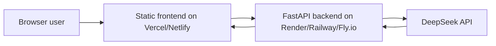

# StackSensei

StackSensei is a publicly deployable Texas Hold'em learning chatbot that supports three product paths: Learn, Practice, and Analyze. It can chat lightly as a card-master coach, explain poker concepts, guide practice choices, and give beginner-friendly hand analysis through a static frontend and a FastAPI backend.

## Public MVP Architecture



This MVP is DeepSeek-only. Users do not download a zip, configure a local model, or enter their own API key. The backend reads `DEEPSEEK_API_KEY` from Render server environment variables only.

## Features

- Learn mode for beginner-friendly rules, terms, and poker concept explanations.
- Practice mode for lightweight educational feedback on scenario choices.
- Analyze mode for structured real-hand review when the user explicitly asks for it.
- Casual chat, capability answers, poker concept explanations, practice feedback, and hand analysis.
- Structured recommendation sections are used only when the user asks for a specific poker hand or decision analysis.
- English and Chinese UI/replies.
- Beginner card selectors that convert ranks and suits into standard poker notation such as `As Kh` and `Qh Jd 7c`.
- Game state panel for cards, action history, pot, stack, position, and player count.
- Voice input and text-to-speech where supported by the browser.
- Static frontend that can be hosted on Vercel or Netlify.
- FastAPI backend with validation, CORS configuration, health check, and tests.

## Tech Stack

- Frontend: HTML, CSS, JavaScript
- Backend: FastAPI, Pydantic, HTTPX
- LLM provider: DeepSeek `deepseek-chat`
- Deployment target: Vercel/Netlify frontend plus Render/Railway/Fly.io backend

## Local Backend Setup

```powershell
cd backend
python -m venv .venv
.venv\Scripts\activate
pip install -r requirements.txt
$env:DEEPSEEK_API_KEY="your_deepseek_key"
$env:CORS_ORIGINS="http://localhost:3000,http://localhost:5173,http://localhost:8000"
$env:ENABLE_LOCAL_MODEL="false"
uvicorn app.main:app --reload --host 0.0.0.0 --port 8000
```

Health check:

```powershell
Invoke-RestMethod http://localhost:8000/health
```

## Local Frontend Setup

For quick local use, open `frontend/index.html` in a browser.

To serve it locally:

```powershell
cd frontend
python -m http.server 3000
```

Then open `http://localhost:3000`.

The frontend reads its backend URL from `frontend/config.js`:

```js
window.STACKSENSEI_API_BASE_URL = window.STACKSENSEI_API_BASE_URL || "http://localhost:8000";
```

For production, set this value to your deployed backend URL.

## Environment Variables

| Variable | Required | Description |
| --- | --- | --- |
| `DEEPSEEK_API_KEY` | Yes | Server-side DeepSeek API key. Never expose this in frontend code. |
| `CORS_ORIGINS` | Yes | Comma-separated allowed frontend origins. |
| `ENABLE_LOCAL_MODEL` | No | Keep `false` for the public MVP. |
| `DEEPSEEK_API_ENDPOINT` | No | Optional override for DeepSeek chat completions endpoint. |
| `DEEPSEEK_MODEL` | No | Defaults to `deepseek-chat`. |

## Backend Chat API

`POST /api/poker-chat` accepts the existing request format and the newer mode-aware format:

```json
{
  "message": "Should I call here?",
  "language": "en",
  "mode": "analyze",
  "gameState": {
    "handCards": "As Kh",
    "communityCards": "Qh Jd 7c",
    "pot": 24,
    "position": "BTN"
  },
  "practiceState": null
}
```

Supported modes are `learn`, `practice`, `analyze`, and `chat`. `mode` and `practiceState` are optional, so older frontend requests continue to work.

Important behavior: `gameState` is context only. Cards, board cards, or pot values do not force hand analysis. StackSensei uses structured analysis only when the latest user message explicitly asks for hand review or decision advice.

## Deployment Overview

Backend:

- Deploy `backend/` to Render.
- Set `DEEPSEEK_API_KEY`, `CORS_ORIGINS`, and `ENABLE_LOCAL_MODEL=false`.
- Start command: `uvicorn app.main:app --host 0.0.0.0 --port $PORT`
- Health check path: `/health`

Frontend:

- Deploy `frontend/` to Vercel as a static site.
- Configure `window.STACKSENSEI_API_BASE_URL` to point to the deployed backend.
- Add the final frontend URL to backend `CORS_ORIGINS`.

See `docs/DEPLOYMENT_GUIDE.md` for full steps.

## GitHub Upload

From the repository root:

```powershell
git init
git add .
git status
git commit -m "Initial GitHub-ready DeepSeek MVP"
git branch -M main
git remote add origin <YOUR_GITHUB_REPO_URL>
git push -u origin main
```

Before pushing, confirm that no `.env`, model weights, datasets, virtual environments, cache folders, or local logs are staged.

## Render Backend Settings

- Service type: Web Service
- Root directory: `backend`
- Build command: `pip install -r requirements.txt`
- Start command: `uvicorn app.main:app --host 0.0.0.0 --port $PORT`
- Health check path: `/health`

Environment variables:

```text
DEEPSEEK_API_KEY=<your DeepSeek API key>
CORS_ORIGINS=http://localhost:3000,https://your-vercel-frontend-url.vercel.app
ENABLE_LOCAL_MODEL=false
```

## Vercel Frontend Settings

- Framework preset: Other / Static
- Root directory: `frontend`
- Build command: leave empty
- Output directory: leave default for the static root

Set `frontend/config.js` to your deployed backend URL before the final frontend deployment:

```js
window.STACKSENSEI_API_BASE_URL = window.STACKSENSEI_API_BASE_URL || "https://your-backend.onrender.com";
```

After Vercel gives you the final frontend URL, add that URL to Render `CORS_ORIGINS` and redeploy the backend.

## Product Behavior Notes

- Users never provide or store API keys in the browser.
- The public backend reads `DEEPSEEK_API_KEY` only from server-side Render environment variables.
- Learn / Practice / Analyze modes are supported without changing the deployment architecture.
- StackSensei behaves like a witty card master and friendly poker coach, with light table-side personality.
- Casual messages such as "Can you chat?" or "你可以聊天吗？" receive natural conversational replies.
- Capability and poker-concept questions are answered in plain coaching style.
- Chinese hand-analysis labels are `建议行动：`, `理由：`, and `风险提示：`.
- Specific hand-analysis requests use `Recommended Action:`, `Reasoning:`, `Risk Note:` in English or `建议行动：`, `理由：`, `风险提示：` in Chinese.
- If a user asks for a recommendation without enough details, StackSensei asks for missing hand cards, position, pot size, and current bet or action history instead of pretending it knows the right action.
- Casual messages such as "Bad luck today", "不咋地手气", or "你是谁" do not trigger structured hand analysis even when `gameState` contains cards.
- Practice feedback is educational and uses scenario context plus `userAction`; it is not a full poker game solver.

## Model Note

The original project includes a fine-tuned Phi-3 Mini poker decision model concept, but the public MVP does not include or require local model weights. `model.safetensors`, merged model directories, and training datasets are intentionally excluded from GitHub.

A later stage can host the Phi-3 model externally and connect it behind a backend feature flag.

## Safety and Usage Note

StackSensei is an educational poker learning assistant. It does not guarantee profitable play, gambling success, or correct decisions in every spot. Use it to learn concepts and reasoning, not as financial advice.
