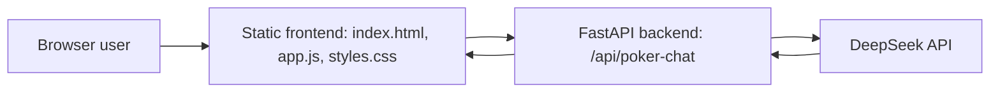

# StackSensei Project Handoff

Last reviewed: 2026-04-29

## One-line Summary

StackSensei is a Texas Hold'em teaching chatbot with a static HTML/CSS/JS frontend and a FastAPI backend. The public MVP is DeepSeek-only: users open the frontend URL, and the backend calls DeepSeek with a server-side API key.

## Current Repository State

The GitHub-ready public MVP exists under the cleaned `stacksensei/` structure.

Important paths:

- `frontend/index.html`: static browser UI.
- `frontend/styles.css`: visual design.
- `frontend/app.js`: frontend state, chat UI, speech recognition, text-to-speech, API calls.
- `frontend/config.js`: public backend base URL configuration.
- `backend/app/`: FastAPI backend modules.
- `backend/requirements.txt`: Python backend dependencies.
- `backend/render.yaml`: Render deployment config.
- `docs/`: collaborator, model/data, improvement, and deployment docs.
- `models/README.md`: explains why model weights are excluded.
- `data/README.md`: explains why large datasets are excluded.

## Architecture



Runtime flow:

1. User enters hole cards, community cards, stack, pot, position, opponents, and a question.
2. Frontend sends `POST /api/poker-chat` to `http://localhost:8000`.
3. Backend validates the request and builds a structured prompt.
4. Backend calls DeepSeek using `DEEPSEEK_API_KEY` from server environment variables only.
5. Response returns `{ action, reply }`.

## Backend Details

Main file: `backend/app/main.py`

Supporting files:

- `backend/app/schemas.py`
- `backend/app/config.py`
- `backend/app/deepseek_service.py`
- `backend/app/prompt_builder.py`

Main API endpoints:

- `POST /api/poker-chat`
- `GET /health`

Request schema:

```json
{
  "message": "Should I call?",
  "gameState": {
    "handCards": "Kd Js",
    "communityCards": "",
    "chips": 100,
    "pot": 7.5,
    "position": "BB",
    "players": 6,
    "opponents": 5
  },
  "language": "en"
}
```

Response schema:

```json
{
  "action": "call",
  "reply": "Action: call\n\n..."
}
```

Model loading:

- Disabled for the public MVP.
- `ENABLE_LOCAL_MODEL` should remain `false`.
- No local model files are required for backend startup.

DeepSeek:

- Endpoint hardcoded as `https://api.deepseek.com/v1/chat/completions`.
- Model name: `deepseek-chat`.
- API key comes only from the backend environment variable `DEEPSEEK_API_KEY`.
- API keys are never accepted from frontend requests.

## Frontend Details

Files:

- `Poker/index.html`
- `Poker/styles.css`
- `Poker/app.js`

Implemented features:

- Dark poker/casino UI with gold accent.
- Game state input panel.
- Chat message rendering with bot avatar.
- Quick question buttons.
- English/Chinese UI toggle.
- DeepSeek API key modal.
- Browser speech recognition through `SpeechRecognition` / `webkitSpeechRecognition`.
- Text-to-speech through `window.speechSynthesis`.
- Local browser storage for language and API key.

Important frontend behavior:

- `backendUrl` defaults to `http://localhost:8000`.
- `opponents` is converted into `players = opponents + 1`.
- Conversation history is maintained in frontend memory, but the current backend does not receive or use it.

## Historical Model Details

The original local demo described a LoRA fine-tuned Phi-3 Mini model trained on 6-handed No Limit Texas Hold'em solver-style data. This is not part of the public MVP deployment path.

Config found in `Poker/merged_model_re/config.json`:

- Architecture: `Phi3ForCausalLM`
- Model type: `phi3`
- Hidden size: `3072`
- Layers: `32`
- Attention heads: `32`
- KV heads: `32`
- Context length: `4096`
- Sliding window: `2047`
- Vocab size: `32064`
- Config dtype: `float16`
- Runtime code currently loads as `torch.float32`

The original extracted model directory did not include the required weight file:

- Missing: `model.safetensors`
- README says the weight was too large for the zip and must be downloaded separately.

The public MVP does not load this model and does not require the weight file.

## Dataset Details

All dataset files are JSON arrays of supervised fine-tuning examples with this structure:

```json
{
  "instruction": "You are a specialist in playing 6-handed No Limit Texas Holdem... Your optimal action is:",
  "output": "call"
}
```

Dataset inventory:

| File | Size | Records | Purpose |
| --- | ---: | ---: | --- |
| `PokerDataSet/preflop_60k_train_set_prompt_and_label.json` | ~56.5 MB | 63,200 | Preflop 6-max decisions |
| `PokerDataSet/postflop_500k_train_set_prompt_and_label.json` | ~534.6 MB | 500,000 | Postflop 6-max decisions |
| `PokerDataSet/mixed_preflop_postflop_50k_train_set.json` | ~51.9 MB | 50,000 | Mixed preflop/postflop training subset |

Data characteristics:

- 6-handed NLHE positions: `UTG`, `HJ`, `CO`, `BTN`, `SB`, `BB`.
- Typical starting stack: 100 chips.
- Blinds: small blind 0.5, big blind 1.
- Inputs are natural-language hand histories.
- Outputs are concise action labels with optional sizing.

Example labels:

- `fold`
- `call`
- `check`
- `bet 18`
- `raise 22`

## Presentation Material Summary

`StackSensei.pdf` and `StackSensei.pptx` describe the product as:

- A poker strategy chatbot for Texas Hold'em learners.
- A teaching assistant with structured action-first answers.
- A hybrid system with:
  - frontend interaction layer,
  - backend routing/model orchestration layer,
  - local model training layer.
- A fine-tuned Phi-3 Mini model trained with real solver-based preflop and postflop datasets in a two-round curriculum.
- LoRA merged into a full-precision model for runtime use.
- Speech recognition and speech synthesis as extra user-facing features.

## Verified Checks

Performed on 2026-04-29:

- `python -m py_compile Poker/main.py`: passed.
- `node --check Poker/app.js`: passed.
- Dataset JSON files can be parsed.
- Model config/tokenizer files exist.

Known missing or fragile items:

- `model.safetensors` is absent.
- `poker-logo.png` is referenced in `index.html` but not present in `Poker/`.
- Several Chinese strings appear mojibaked/encoding-damaged.
- Some HTML attributes around Chinese text look malformed in `index.html`.
- No automated tests are present.
- No deployment configuration is present.
- No Git repository metadata was present in the workspace during review.
